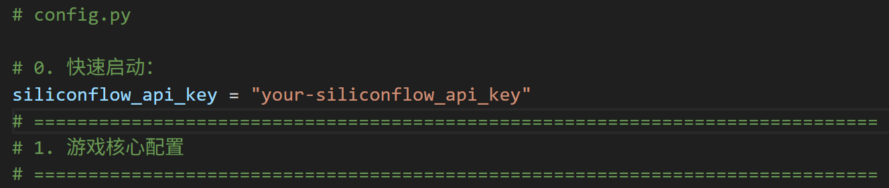

# AnimeAIwolf: LLM and TTS-Powered Anime Character Werewolf Game

[中文说明](README_zh.md) | English

## Character Preview
       

## Project Overview
AnimeAIwolf is an anime character role-playing Werewolf game powered by Large Language Models (LLM) and Text-to-Speech (TTS) technology.

## GitHub Source Code Installation
### Environment Setup
1. It's recommended to install dependencies in a virtual environment:
   ```bash
   pip install -r requirements.txt
   ```
2. Run the program:
   ```bash
   python app.py
   ```
**Note**: The following tutorials apply to both source code and one-click package installations.

> 💖 If you find this project helpful, please give it a Star!

## One-Click Package Tutorial
The core configuration file is `config.py`. You need to modify various configuration parameters according to your needs.

### 1. Quick Start
1. **Register SiliconFlow Account**
   - Visit: [https://cloud.siliconflow.cn/i/vKgMJi1F](https://cloud.siliconflow.cn/i/vKgMJi1F)
   - Get your API Key
2. **Configure API Key**
   - Find the `0. Quick Start` section in `config.py`
   - Enter your SiliconFlow API Key in `siliconflow_api_key`
3. **Launch Program**
   - Double-click `启动.bat` (Launch.bat)
   - Open `http://localhost:5000` in your browser



### 2. Character Customization
#### 2.1 Character Nicknames and Personality Settings
1. Find the `2. Character Role-Playing and Nickname Configuration` section
2. Modify nicknames and personality settings for each character
3. **Important Note**: Character `7` is always the player character

#### 2.2 Character Avatar Settings
1. Navigate to the `./images` directory in the main folder
2. Modify or add/remove images according to character nickname order
3. Image filenames must correspond one-to-one with character IDs

#### 2.3 Character Voice Configuration
1. **Configuration Path**
   - Find the `6. Audio and TTS Configuration` section
   - Modify audio paths and corresponding texts in `reference_audios` and `reference_texts`
2. **Restart Settings**
   - To ensure changes take effect, delete the `siliconflow_voices.json` file in the main directory
   - Restart the program
3. **TTS Service Selection**
   
   **Option 1: SiliconFlow TTS Service**
   - Use default settings in the configuration file
   
   **Option 2: Local GPT-SoVITS**
   - GPT-SoVITS models trained for different characters perform better
   - Project: [https://github.com/RVC-Boss/GPT-SoVITS](https://github.com/RVC-Boss/GPT-SoVITS)
   - Start API service:
     ```bash
     runtime\python.exe api_v2.py -a 127.0.0.1 -p 9880 -c GPT_SoVITS/configs/tts_infer.yaml
     ```
4. **Audio Playback Optimization**
   - If character voices overlap severely, adjust the `audio_play_delay` parameter

### 3. LLM Service Configuration
#### 3.1 Ollama Local Model
- The project supports Ollama local model deployment

#### 3.2 Other LLM Services
- Compatible with other API services that support OpenAI interface
- Modify `openai_compatible` related configurations in `3. LLM Provider and Model Configuration`

#### 3.3 Recommended Configuration
**Deepseek-V3 + GPT-SoVITS** combination

### 4. Advanced Configuration Options
#### 4.1 Game Core Configuration
- **Configuration Location**: `1. Game Core Configuration` → `GAME_CONFIG`
- **Adjustable Content**:
  - Number of each role type
  - Conversation initiation rules
  - Other game parameters

⚠️ **Important Note**: If you increase `players_count`, please update the following configurations accordingly:
- `2. Character Role-Playing and Nickname Configuration`
- `6. Audio and TTS Configuration`

#### 4.2 LLM Generation Parameters
- **Configuration Location**: `4. LLM Generation Parameter Configuration`
- **Function**: Fine-tune performance of each role (limited impact)

#### 4.3 Prompt Template Modification
- **Modification Location**: `image_utils.py` → `construct_llm_prompt` function
- **Note**: Please ensure you understand the impact of modifications

⚠️ **Warning**: Please make sure you understand the consequences before modifying these parameters

### 5. FAQ
#### Q: What if the first startup fails when using SiliconFlow TTS API?
**A:** This is a known bug. Solution:
1. Close the terminal
2. Restart the `.bat` file

### 6. Future Plans
- Develop more interesting multi-character role-playing LLM applications based on the current foundation
- Continuously optimize game experience and AI performance

### 7. Contact Us
For bugs or technical support, contact us through:
- **📧 Email**: cialtion737410@sjtu.edu.cn
- **📺 Bilibili**: https://www.bilibili.com/video/BV1MVemzUE9r
- **💬 QQ Group**: Not yet available

---

## Contributing
Welcome to submit Issues and Pull Requests to improve the project!

## License
This project is open-sourced under the [MIT License](LICENSE).